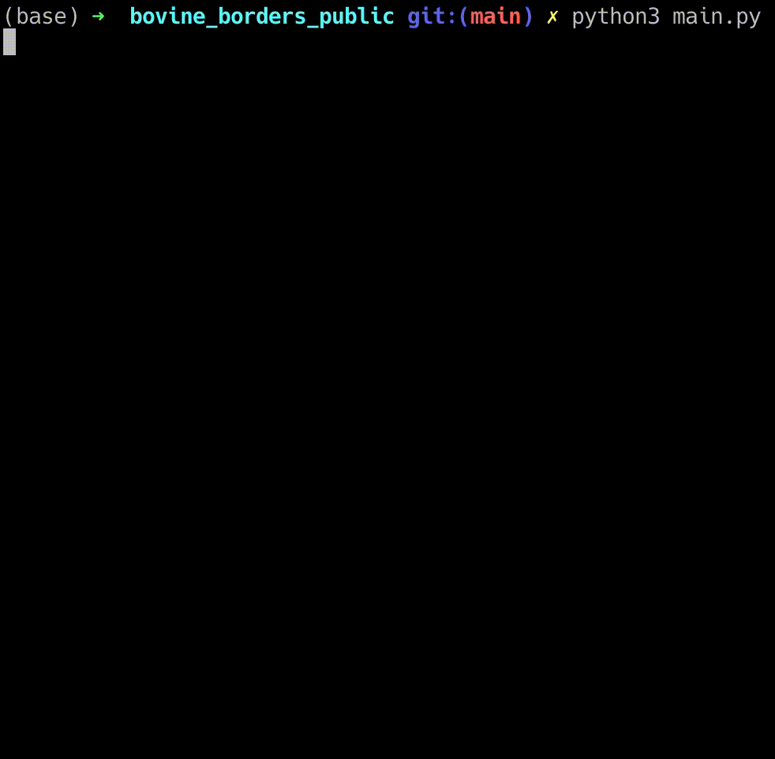
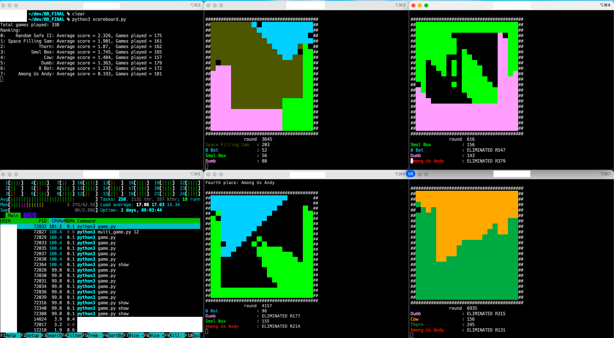

A game for a school contest called JiggaJigga, written by GitHub users @LemonKat and @Vodiboi.

The contest involved writing a bot to play this game, and then facing off against other students' bots.  
This year, @LemonKat and @Vodiboi ran the contest, with a game called Bovine Borders. It's a little like Risk.

To run:
1. read the rules, in `rules.pdf`
2. code your bot up somewhere
3. change main.py to import the bot and add it to the game
4. run `python3 main.py`

Detailed instructions are in the rules PDF.  
There's a couple example bots in `sample_ais.py`, and more in `more_sample_ais.py`.

Have fun!

I (@LemonKat) also spent some time training an AI to play this game. I used a Double DQN algorithm, with the reward for each turn of the game set to how much territory the AI had by the end of that turn.

To set that up:
1. run `python3 train.py`
2. import the bot from `svarog.py`
3. run as normal